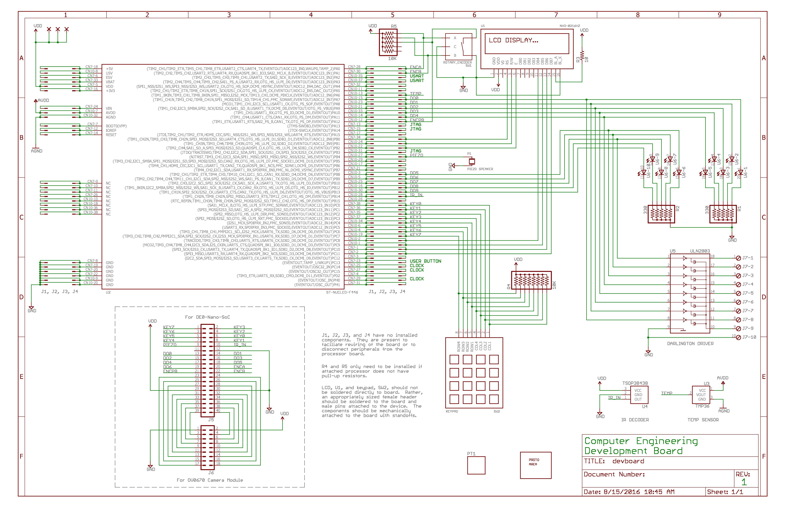

# Serial Console with Temperature Detection
## Description:
This is the final project from the course Embedded System 1. The processor of the embedded system was STM32F446RE, and the board schema is shown below:

